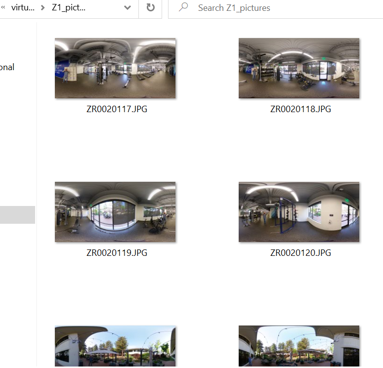

# RICOH THETA Z1 Virtual Tour Taken with Timeshift Plug-in

Indoor and outdoor virtual tour demo made with the open source software 
http://www.marzipano.net

## Web Demo

[https://codetricity.github.io/theta-z1-virtual-tour/](https://codetricity.github.io/theta-z1-virtual-tour/)

## Comparison to X and Workflow

There is another tour taken with the X at the same time for comparison.

The Z1 images are 6.7K JPG taken with default automatic settings.  It uses the timeshift plug-in to get the photographer out of the picture.

There is a YouTube video showing the workflow.

## Images

Prior to putting the images up on the tour, they are in equirectangular mode.

